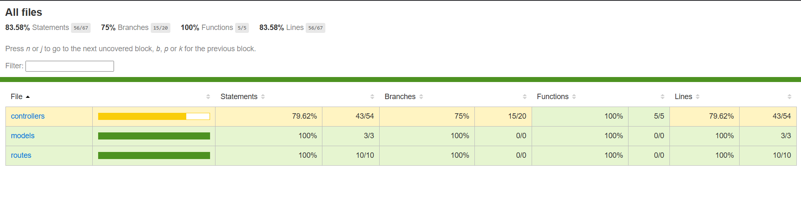
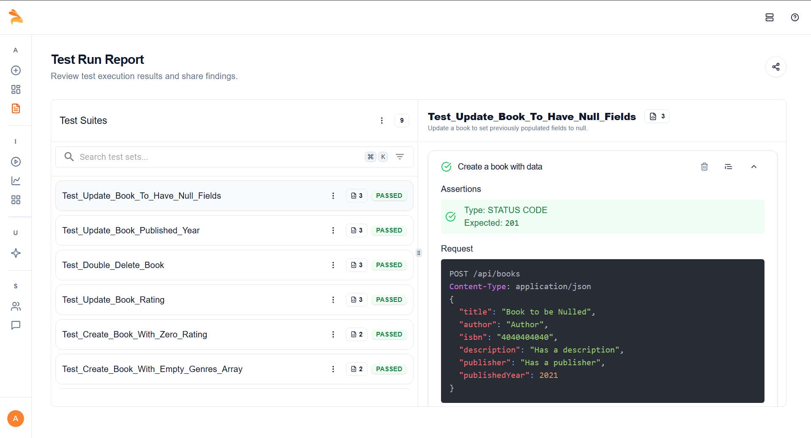

# 📚 MERN Book Management System

A full-stack Book Management System built with the MERN stack (MongoDB, Express.js, React.js, Node.js). This app allows users to view, add, edit, and delete books with image upload support.

---

## 🚀 Features

- 📖 List all books
- 🔍 View detailed book info
- ➕ Add new book with cover image
- ✏️ Edit book information
- 🗑️ Delete books
- 📂 Drag & drop image upload
- ⭐ Rating and reviews support
- 🎨 TailwindCSS-based clean UI

---

## 🛠️ Tech Stack

- **Frontend:** React.js + React Router + Tailwind CSS
- **Backend:** Node.js + Express.js
- **Database:** MongoDB (via Mongoose)
- **File Uploads:** Multer
- **State Management:** useState, useEffect

---

## 📁 Project Structure

```
project-root/
├── backend/
|       └── mongoDB
|             ├── Tests/
│             |     ├── Unit-Testing/
│             |     │     ├── bookController.mocked.test.js
|             |     |     └── bookController.real.test.js
│             |     ├── Integration-Testing/
│             |     │      └── bookRoutes.integration.test.js 
|             |     └── API-Testing/
│             |           └── bookAPI.test.js  
│             ├── controllers/
│             │     └── bookController.js
│             ├── models/
│             │     └── Book.js
│             ├── routes/
│             │     └── bookRoutes.js
│             ├── middlewares/
│             │     └── upload.js
|             ├── uploads/
│             └── index.js
│
├── frontend/
│ ├── components/
│ │ └── BookForm.jsx
│ ├── pages/
│ │ ├── EditBook.jsx
│ │ └── BookDetails.jsx
│ └── App.jsx
│
├── uploads/ # Image uploads (auto-generated)
├── .env # Environment variables
├── README.md
```


---

## ⚙️ Installation & Setup

### 1. Clone the Repository

```bash
git clone https://github.com/yourusername/mern-book-app.git
cd mern-book-app
```

### 2. Setup Backend
```bash
Copy
Edit
cd backend
npm install
cp .env.example .env

# Fill .env
MONGO_URI=mongodb://localhost:27017/bookapi
PORT=5000
npm start
```
### 3. Setup Frontend
```bash
cd ../frontend
npm install
npm run dev
``` 
### ⚠️ Requirements
- Node.js and npm
- MongoDB running locally or via Atlas

<h2>📡 API Endpoints</h2>

<table>
  <thead>
    <tr>
      <th>Method</th>
      <th>Endpoint</th>
      <th>Description</th>
    </tr>
  </thead>
  <tbody>
    <tr>
      <td>GET</td>
      <td><code>/api/books</code></td>
      <td>Get all books</td>
    </tr>
    <tr>
      <td>GET</td>
      <td><code>/api/books/:id</code></td>
      <td>Get single book</td>
    </tr>
    <tr>
      <td>POST</td>
      <td><code>/api/books</code></td>
      <td>Add new book</td>
    </tr>
    <tr>
      <td>PUT</td>
      <td><code>/api/books/:id</code></td>
      <td>Update existing book</td>
    </tr>
    <tr>
      <td>DELETE</td>
      <td><code>/api/books/:id</code></td>
      <td>Delete book</td>
    </tr>
  </tbody>
</table>

## 🧩 Book Schema (Mongoose)
```js
const bookSchema = new mongoose.Schema({
  title: String,
  author: String,
  isbn: String,
  description: String,
  publisher: String,
  rating: Number,
  reviews: Number,
  genres: [String],
  image: String, // /uploads/filename.jpg
});
```

## 🧪 Testing & Coverage

#### This project includes:
- ✅ Unit Tests (mocked and real DB)
- ✅ Integration Tests (with MongoDB in-memory server)
- ✅ API Tests (with live endpoints)
- ✅ Code coverage report using Jest

### 🔧 Run All Tests
```bash
npm test
```
### 📊 Run with Coverage Report
```bash
npm test --coverage
```
### 🧾 Test Tools Used
- Jest – for running all tests
- Supertest – for API route testing
- mongodb-memory-server – for in-memory MongoDB instance used in tests

<h2>✅ Test Summary</h2>

<table>
  <thead>
    <tr>
      <th>Requirement</th>
      <th>Status</th>
    </tr>
  </thead>
  <tbody>
    <tr>
      <td>Unit tests (mocked + real)</td>
      <td>✅ Complete</td>
    </tr>
    <tr>
      <td>Integration tests</td>
      <td>✅ Complete</td>
    </tr>
    <tr>
      <td>API endpoint tests</td>
      <td>✅ Complete</td>
    </tr>
    <tr>
      <td>Jest test coverage &gt; 70%</td>
      <td>✅ 83.58%</td>
    </tr>
    <tr>
      <td>README includes test info</td>
      <td>✅ Done</td>
    </tr>
    <tr>
      <td>Test coverage screenshot</td>
      <td>✅<br></td>
    </tr>
    <tr>
      <td>Keploy API Test Report</td>
      <td>✅<br> All test suites (26/26) passed using Keploy's AI-powered API test automation.</td>
    </tr>
  </tbody>
</table>

## ⚙️ CI/CD Configuration


GitHub Actions workflow to run Keploy API tests:
[👉 View Workflow File](https://github.com/anthony-rozario/book-management-api/blob/main/.github/workflows/ci.yml)

## 📦 Multer File Upload
`upload.js` uses `multer.diskStorage` to store images in `/uploads.`

Filenames are sanitized to replace spaces with `-`.

## 📋 FormData Handling in React
```js
const payload = new FormData();
payload.append("title", formData.title);
payload.append("image", formData.image);
// etc...
```
##### Genres are added as:

```js
formData.genres.forEach((g) => payload.append("genres[]", g));
```
## 🔄 Edit Book Flow
- `EditBook.jsx` fetches book using `useParams()`

- Passes data to `<BookForm isEdit={true} />`

- Form sends `PUT` request with `FormData`

## 📸 Screenshots
##### Add screenshots of:
 - Book list page
 - Add book form
 - Book details view
 - Edit book form

## ✅ Improvements To Add
- User authentication
- Cloud image uploads (Cloudinary/S3)
- Search and filter by genre/author
- Pagination

## 👨‍💻 Author
Anthony Prakash Rozario

MCA 🎓- KIIT University


## 📄 License
MIT License. Free for personal and commercial use.
